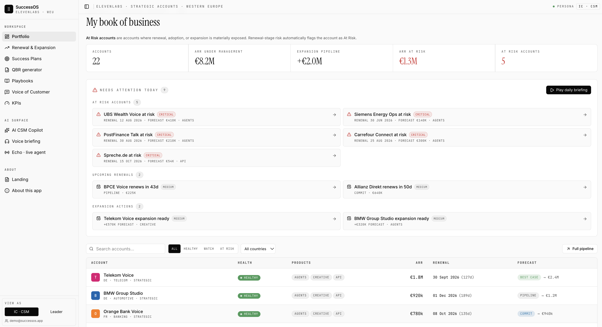
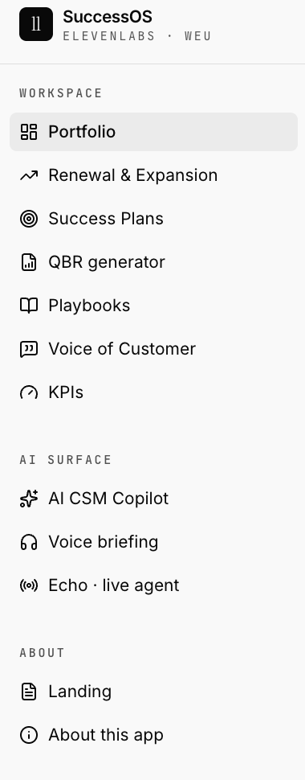
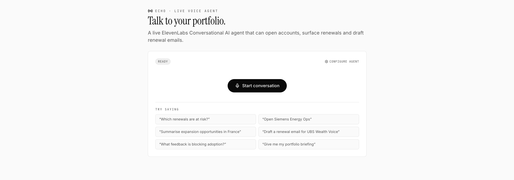
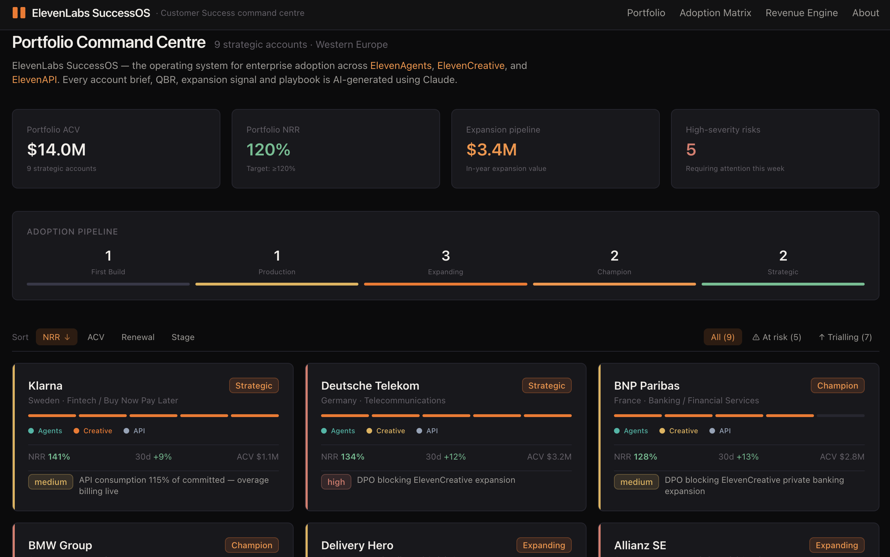

# SuccessOS · ElevenLabs

> An AI-native Customer Success operating system built to show how a Strategic
> CSM can leverage AI across their daily workflow — built for the ElevenLabs
> Customer Success · Strategic · Western Europe motion.

🔗 **Workflow surface (Lovable + ElevenLabs API)** → https://eleven-pathfinder-compass.lovable.app/portfolio
🔗 **Depth surface (Vercel + Claude)** → https://claude-successos-d7n7.vercel.app

---

## Why this exists

This project was built as a portfolio piece for the **Customer Success ·
Strategic · Western Europe** role at ElevenLabs. ElevenLabs sells voice-AI to
enterprises across the EU — which means a Strategic CSM is carrying a book of
20-30 enterprise accounts spanning multiple verticals, regulatory regimes,
and product lines (ElevenAgents, ElevenCreative, ElevenAPI).

That motion deserves its own operating system — and crucially, one where AI
isn't bolted on as a feature, but woven into how the CSM actually works.

SuccessOS explores this through **two surfaces**, each demonstrating a
different mode of AI integration in Customer Success:

| Surface | Mode of AI integration |
|---|---|
| **Workflow surface** (Lovable + ElevenLabs API) | AI as a first-class workspace destination — a dedicated "AI surface" navigation section with three tools (Copilot, Voice briefing, Live agent) |
| **Depth surface** (Vercel + Claude) | AI as embedded augmentation — every analytical artifact (account briefs, QBRs, expansion signals, adoption playbooks) AI-generated inside the data layer |

Both are live. Both use synthetic data. Both prove that AI for CSMs isn't a
future capability — it's already buildable today.

---

## Surface 1 — Workflow (Lovable + ElevenLabs API)

Built for the daily operating reality of a Strategic CSM in Western Europe.

**Workspace** (7 modules)

- **Portfolio** — 22-account book, €8.2M ARR under management, 3-tier health (Healthy / Watch / At Risk), days-to-renewal tracking, Best Case / Pipeline / Commit forecast taxonomy
- **Renewal & Expansion** — full pipeline view across renewal and expansion motions
- **Success Plans** — per-account strategic plans
- **QBR Generator** — executive-ready Quarterly Business Reviews
- **Playbooks** — repeatable operating motions
- **Voice of Customer** — feedback synthesis
- **KPIs** — performance dashboards

**AI surface** (3 dedicated tools — the differentiator)

- **AI CSM Copilot** — streaming chat with tools: account summarisation, next-best-action drafting, expansion play proposal, QBR generation
- **Voice briefing** — 30-second daily red-account summary in DE / FR / EN via ElevenLabs TTS
- **Echo · live agent** — a live WebRTC voice agent that can open accounts, surface renewals, and draft renewal emails

**Persona switching** — IC · CSM vs Leader views, demonstrating how AI surfaces
differ by role.

22 modelled accounts across DACH, Switzerland, France, and the Nordics —
including Telekom, BMW, UBS, Siemens Energy, PostFinance, Carrefour, BPCE,
Allianz Direkt, AXA Assist, Orange Bank.

---

## Surface 2 — Depth (Vercel + Claude)

Built for the analytical layer where AI does its work invisibly inside every
artifact a senior CSM produces.

- **9 strategic accounts with deep narrative** — Klarna, Deutsche Telekom, BNP Paribas, BMW, Allianz, Delivery Hero, HelloFresh, N26, Zalando
- **$14M ACV portfolio · 120% NRR · $3.4M expansion pipeline**
- **Risk watchlist with named stakeholders** — DPOs, CPOs, CISOs surfaced by name, with regulatory blockers spelled out (GDPR data residency, EU AI Act disclosure, MiFID II financial advice scope, procurement RFP windows)
- **Adoption pipeline progression** — First Build → Production → Expanding → Champion → Strategic
- **Account-level adoption matrix** across ElevenAgents, ElevenCreative, ElevenAPI
- **Five Claude features used appropriately** — extended thinking for account briefs, streaming for QBR generation, tool use for expansion signal discovery, self-reviewing single-pass generation for adoption playbooks, structured output throughout
- **Voice Briefing** via the ElevenLabs API

---

## What this demonstrates

1. **Strategic CSM craft** — modelled accounts, regulatory blockers, and
   stakeholder dynamics reflect 10+ years running real strategic portfolios at
   Salesforce and Tableau
2. **AI-native product thinking** — AI surfaces as a *workspace destination*
   in one app; AI embeds as *invisible augmentation* in the other. Both modes
   matter for a CSM tool, and most products only do one.
3. **AI engineering fluency** — five distinct Claude features used appropriately,
   plus deep ElevenLabs API integration including WebRTC voice agents
4. **Stack-agnostic velocity** — the same operating model built on two stacks
   (Lovable/ElevenLabs and Vercel/Claude) in days
5. **Voice-native product thinking** — an AI CSM tool for ElevenLabs should
   *speak*. So it does, in three languages.

---

## At a glance

| | Workflow surface (Lovable) | Depth surface (Vercel) |
|---|---|---|
| Build platform | Lovable | Next.js on Vercel |
| LLM | via Lovable + ElevenLabs API | Claude (Anthropic) |
| Accounts modelled | 22 | 9 |
| ARR / ACV | €8.2M ARR | $14M ACV |
| Modelled health states | Healthy / Watch / At Risk | At risk / Trialling per account |
| AI integration mode | Dedicated AI workspace section | Embedded in every analytical artifact |
| Voice | Multi-language briefing + WebRTC live voice agent | Voice briefing only |
| Persona switching | Yes (IC · CSM vs Leader) | No |
| Data | Synthetic | Synthetic |

---

## What's next

- Live CRM integration (Salesforce, HubSpot) replacing synthetic data
- Multi-CSM workspace with handoff workflows tied to renewal calendar
- Voice agent in additional EMEA languages (IT, ES, NL)
- Inbound voice flow: CSM-facing call analysis and summarisation

---

## Related work

- **[Customer Growth OS](https://github.com/DavLMZ/customer-growth-os)** — the
  agnostic version of this operating model, applied across multiple verticals
  and not tied to a specific company or product
- **[AI-Native GTM](https://github.com/DavLMZ/ai-native-gtm)** — the underlying
  frameworks and methodology

---

## About me

David Le Maistre Zelee — AI-Native GTM & Customer Growth operator.
Ex-Salesforce/Tableau ($54.5M portfolio, 113% retention attainment, scaled EMEA
CS 3→40+). Based in London, fluent in French and English.

[LinkedIn](https://www.linkedin.com/in/davidzelee) · [Email](mailto:david.zelee@gmail.com) ·
[builderos.io](https://builderos.io)

---

*All customer data is synthetic. Built as a portfolio piece for the ElevenLabs
Customer Success — Strategic — Western Europe role.*
